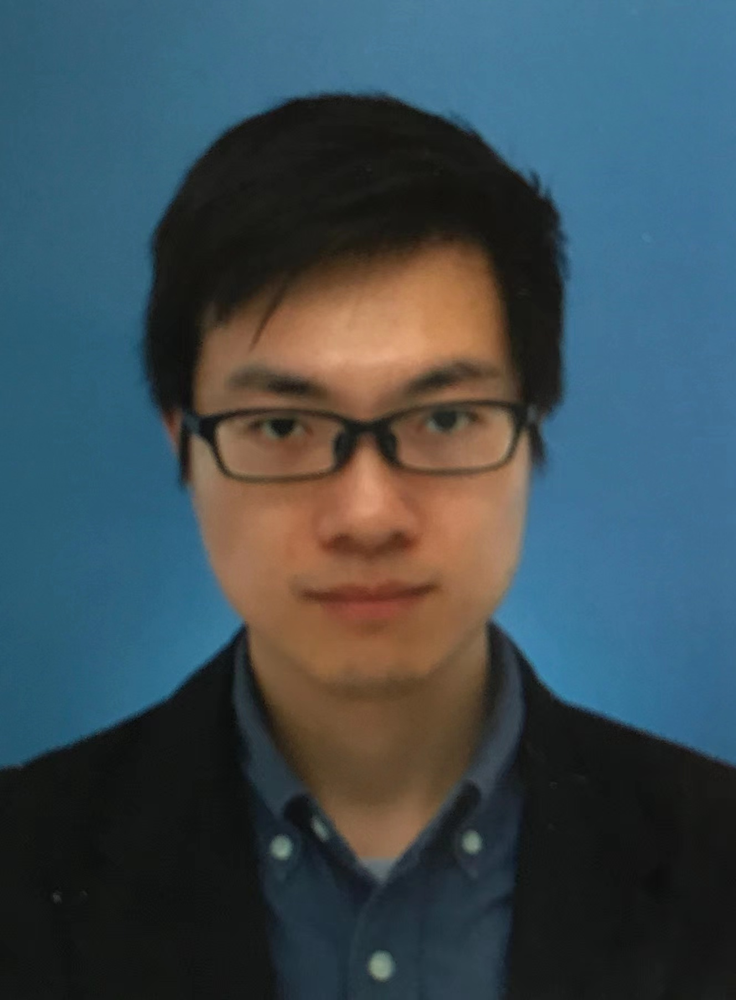
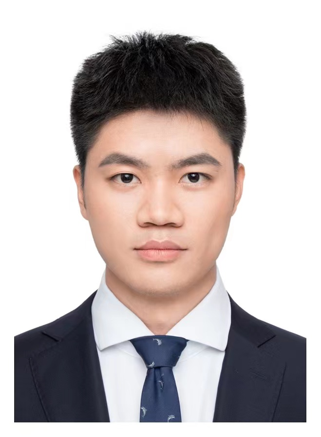
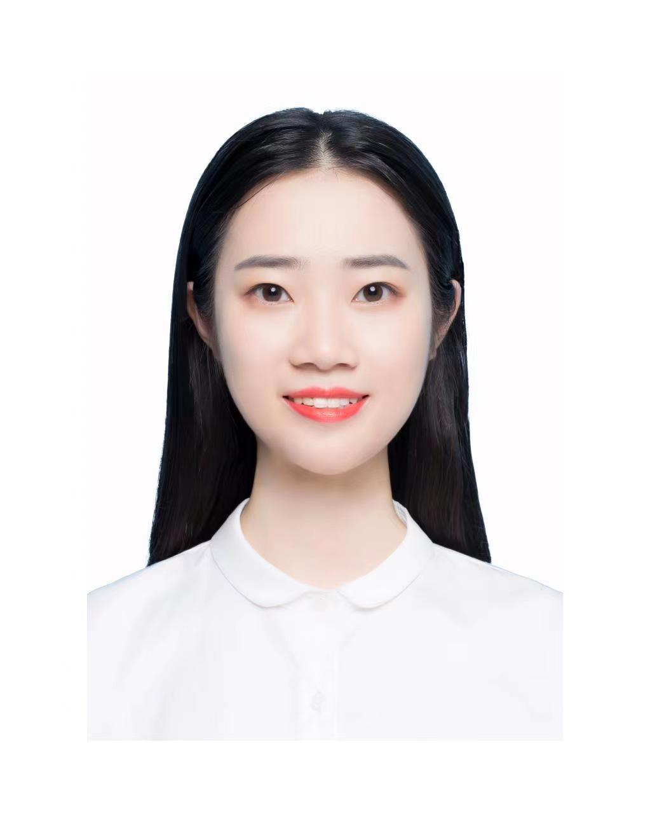
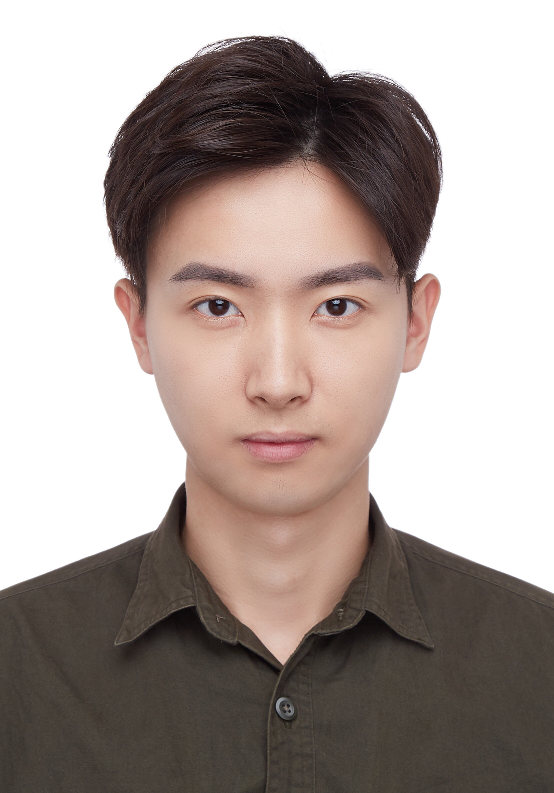
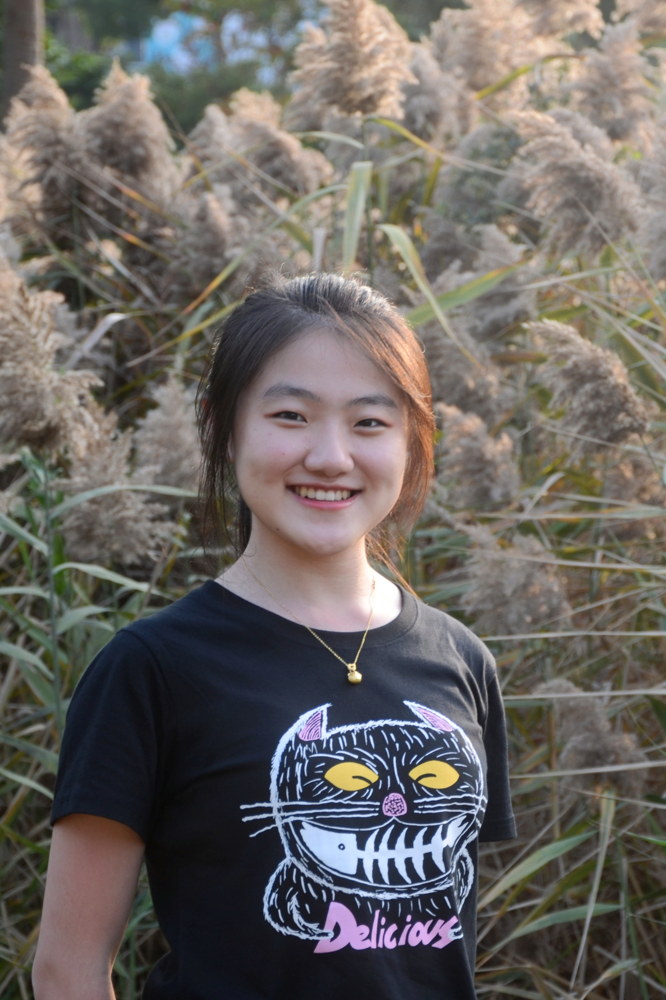
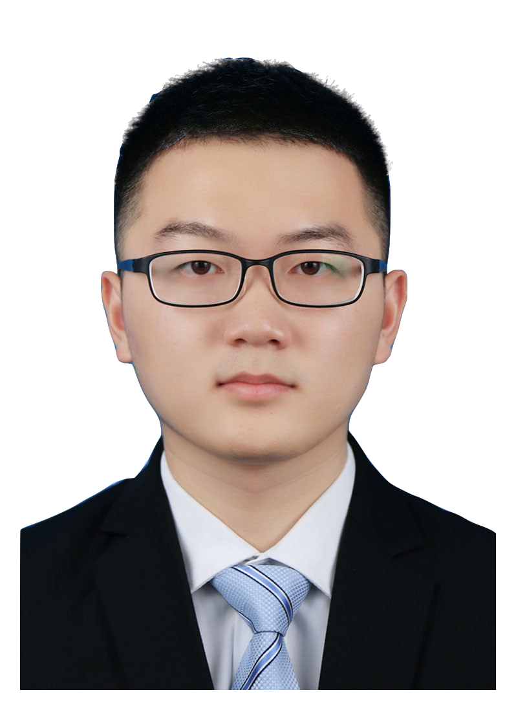

## Activities
  Year end group trip to Lamma Island on 20th Dec., 2022

## Postdocs

  [ZHOU Qi](https://kishuqizhou.github.io/), join in May 2022 Highest degree so far: Ph.D., University of Tokyo

  [WANG Dan](https://danwang9264.github.io/), join in June 2022 Highest degree so far: Ph.D., Beijing University of Technology

## Ph.D.s

  [DUAN Zeyu](https://zyduan-neptune.github.io/ZyDuan.github.io/), join in September 2022 Highest degree so far: Master, Tongji University

  [GUO Mingyue](https://lunaguo.github.io/), join in September 2022 Highest degree so far: Master, Tongji University

  ZHENG Wanfu, join in September 2022 Highest degree so far: Master, KTH Royal Institute of Technology

  WU Si, join in September 2022 Highest degree so far: Master, Shanghai Jiao Tong University

## Alumni

  [DENG Weishun](https://weishundeng.github.io/), join as Research Assistant between April until August 2022 Highest degree so far: Master, Shanghai Jiao Tong University