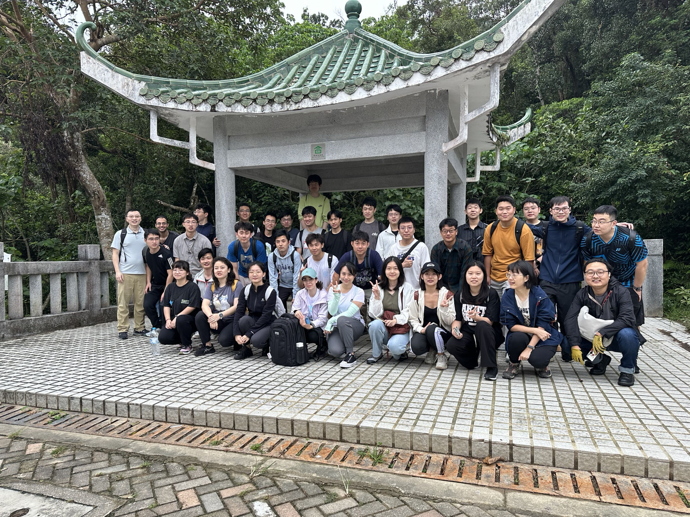
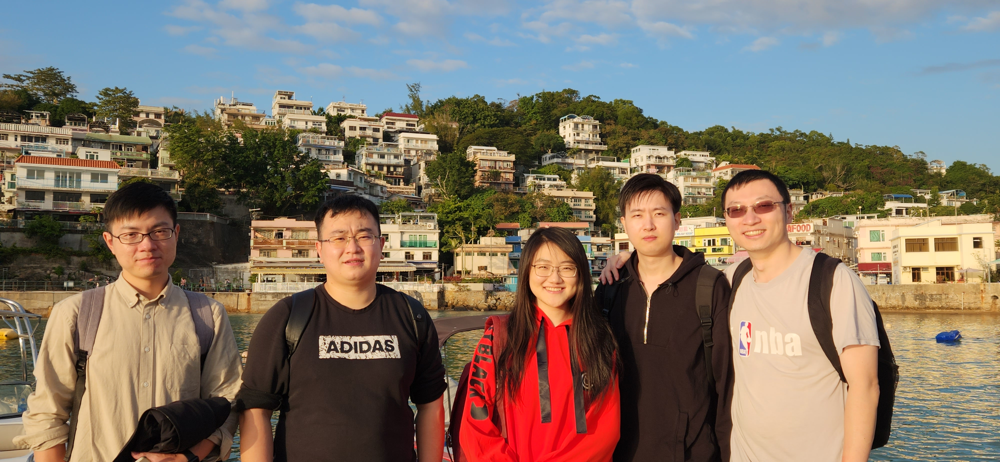
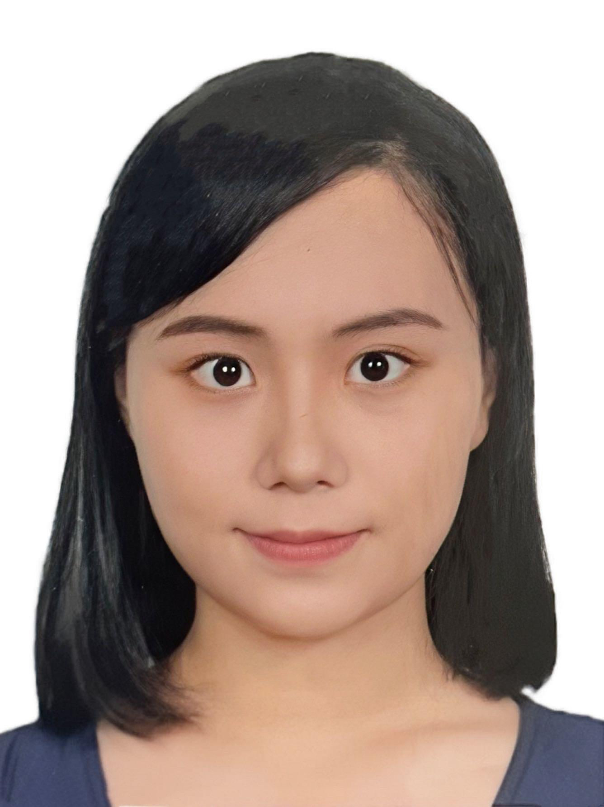
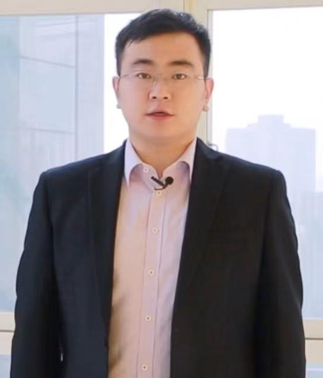
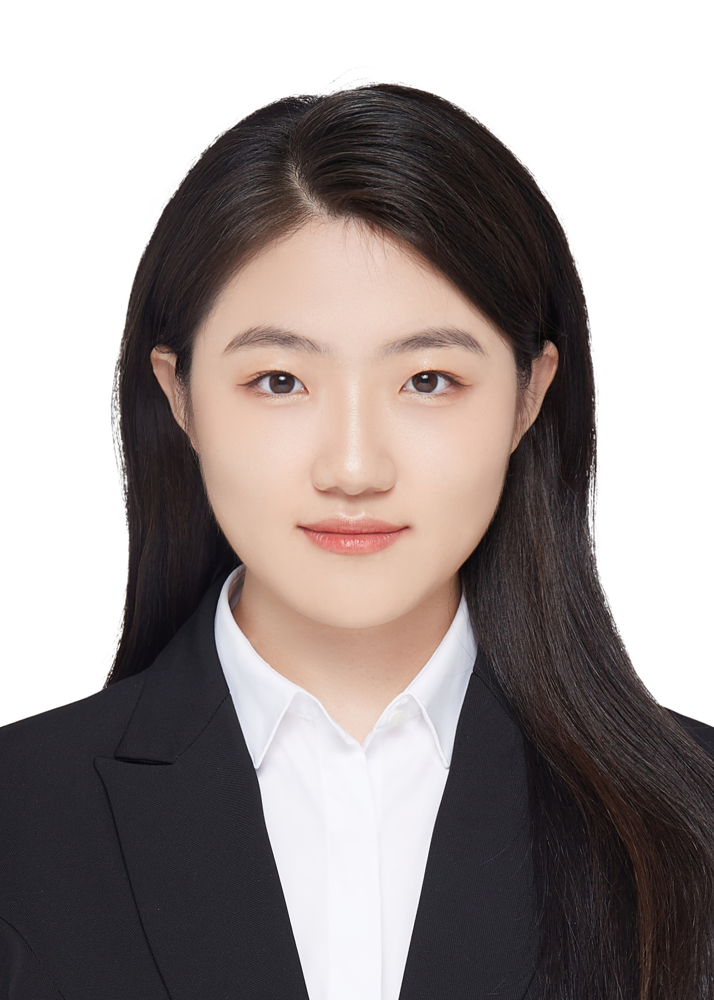
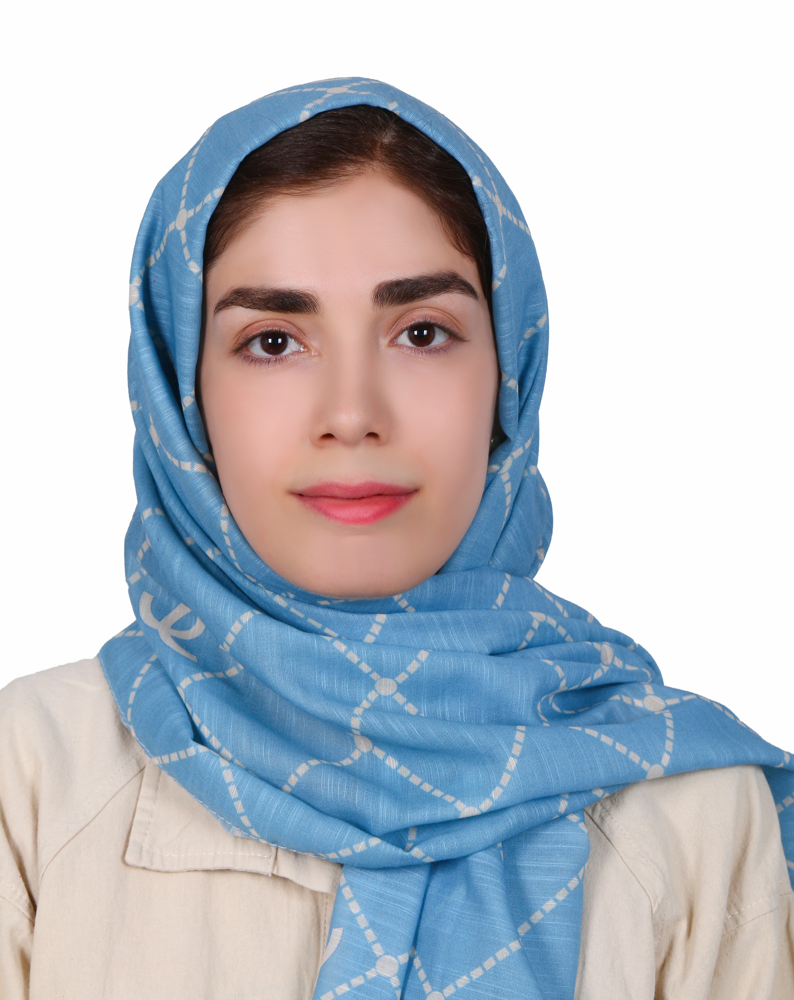
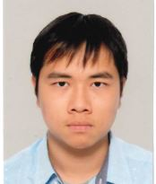

## Activities
  Golf and group dinner at The Jockey Club Kau Sai Chau Public Golf Course on 21st Sep., 2024
  Group Chung Yeung Festival Hiking to High Junk Peak on 21st Oct., 2023
  Year end group trip to Lamma Island on 20th Dec., 2022

## Postdocs

  [Liutao Chen](https://chenlt326.github.io/), join in September 2023 Highest degree so far: Ph.D., The Hong Kong University of Science and Technology

## Ph.D. & M.Phil.

  [DUAN Zeyu](https://zyduan-neptune.github.io/ZyDuan.github.io/), join in September 2022 Highest degree so far: Master, Tongji University

  ZHENG Wanfu, join in September 2022 Highest degree so far: Master, KTH Royal Institute of Technology

  WU Si, join in September 2022 Highest degree so far: Master, Shanghai Jiao Tong University

  [LIN Zinan](https://zinanlin-oscar.github.io/), join in September 2023 Highest degree so far: Master, The Hong Kong University of Science and Technology

  [ZHANG Shihong](https://shihongzhang1999.github.io/), join in September 2023 Highest degree so far: Master, Wuhan University

  [LI Mingchen](https://limingchen159.github.io/), join in September 2023 Highest degree so far: Master, Tianjin University

  ZHAO Lige, join in September 2023 Highest degree so far: Bachelor, Tsinghua University

  Parastoo Mohebi, join in September 2023 Highest degree so far: Master, Sharif University of Technology

  LI Siqi, join in Feb 2024 Highest degree so far: Master, University of Tokyo

  LI Lunlong, join in Sep 2024 Highest degree so far: Bachelor, Southeast University

  LI Shuhao, join in Sep 2024 Highest degree so far: Bachelor, Southeast University

  LU Kunhan, join in Sep 2024 Highest degree so far: Master, Tongji University

  HU Ziqi, join in Sep 2024 Highest degree so far: Master, Nankai University

  CHENG Donald Ip, join in Sep 2024 Highest degree so far: Master, HKUST

  TANG Hadrian Wai To, join in Sep 2024 Highest degree so far: Bachelor, HKUST

## Alumni

- [ZHOU Qi](https://kishuqizhou.github.io/), Postdoc, 2022-2024. Joining Midea

- [WANG Dan](https://danwang9264.github.io/), Postdoc, 2022-2024. Joining Beijing University of Civil Engineering and Architecture as Associate Professor

- LUO Haomin, MSc student, 2022. Joining University of Cambridge as a Ph.D student

- DING Yirong, MSc student, 2023. Joining Virginia Tech as a Ph.D student

- JIANG Zhan, MSc student, 2023. Joining Stevens Institute of Technology as a Ph.D student

- ZHANG Daze, MSc student, 2023. Joining [P&T Group](https://web.p-t-group.com/en/) as buildng energy consultant

- HAN Runze, MSc student, 2023. Joining 哈尔滨电气国际工程责任有限公司 as civil and construction engineer

- XU Lingming, MSc student, 2023. Joinging Alibaba Cloud as a product manager

- FU Tianyu, MSc student, 2023. Joinging Shanghai Metro Group as an engineer

- QU Yao, MSc student, 2023. Joinging HKUST as a Ph.D student

- SO Siu Kuen Ella, MSc student, 2023. Joinging Arup as a consultant