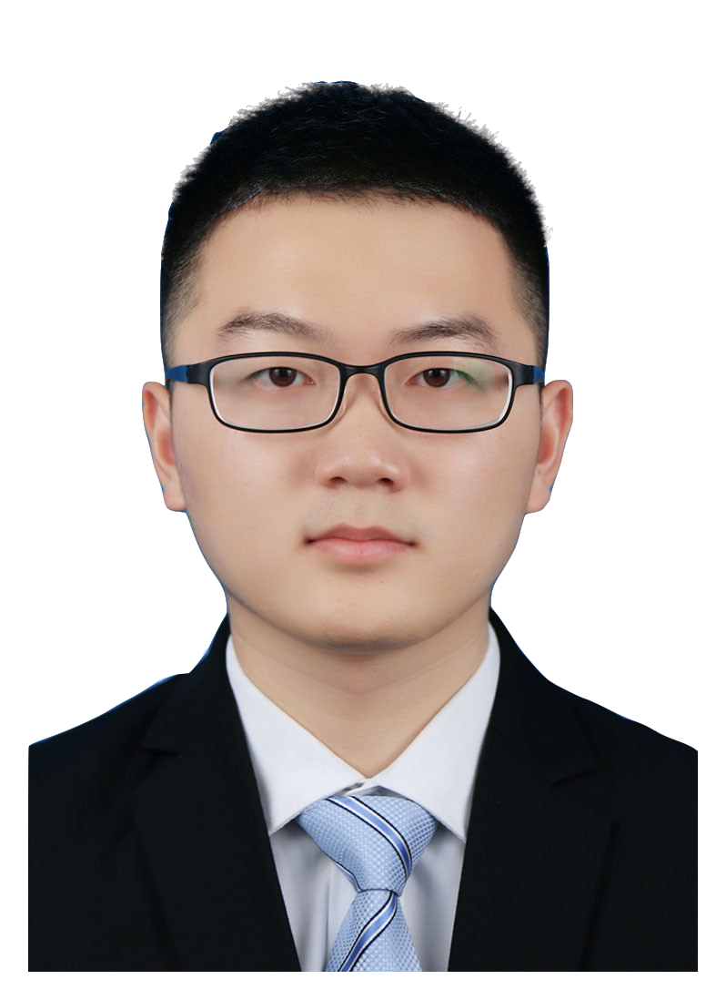

## Activities
  Group Chung Yeung Festival Hiking to High Junk Peak on 21th Oct., 2023
  Year end group trip to Lamma Island on 20th Dec., 2022

## Postdocs

  [ZHOU Qi](https://kishuqizhou.github.io/), join in May 2022 Highest degree so far: Ph.D., University of Tokyo

  [WANG Dan](https://danwang9264.github.io/), join in July 2022 Highest degree so far: Ph.D., Beijing University of Technology

  Liutao Chen, join in September 2023 Highest degree so far: Ph.D., The Hong Kong University of Science and Technology

## Ph.D. & M.Phil.

  [DUAN Zeyu](https://zyduan-neptune.github.io/ZyDuan.github.io/), join in September 2022 Highest degree so far: Master, Tongji University

  ZHENG Wanfu, join in September 2022 Highest degree so far: Master, KTH Royal Institute of Technology

  WU Si, join in September 2022 Highest degree so far: Master, Shanghai Jiao Tong University

  [LIN Zinan](https://zinanlin-oscar.github.io/), join in September 2023 Highest degree so far: Master, The Hong Kong University of Science and Technology

  ZHANG Shihong, join in September 2023 Highest degree so far: Master, Wuhan University

  [LI Mingchen](https://limingchen159.github.io/), join in September 2023 Highest degree so far: Master, Tianjin University

  ZHAO Lige, join in September 2023 Highest degree so far: Bachelor, Tsinghua University

  Parastoo Mohebi, join in September 2023 Highest degree so far: Master, Sharif University of Technology

  HUANG Hai, join in Feb 2024 Highest degree so far: Bachelor, Harbin Institute of Technology

## Alumni

  [DENG Weishun](https://weishundeng.github.io/), joined as Research Assistant between April until August 2022 Highest degree so far: Master, Shanghai Jiao Tong University

  DING Yirong, joined as Master of Science student in 2023 After graduation, Yirong joined Virginia Tech as a Ph.D student

  JIANG Zhan, joined as Master of Science student in 2023 After graduation, Zhan joined Stevens Institute of Technology as a Ph.D student

  ZHANG Daze, joined as Master of Science student in 2023 After graduation, Daze joined [P&T Group](https://web.p-t-group.com/en/) as buildng energy consultant

  HAN Runze, joined as Master of Science student in 2023 After graduation, Runze joined [P&T Group](https://web.p-t-group.com/en/) as civil and construction engineer