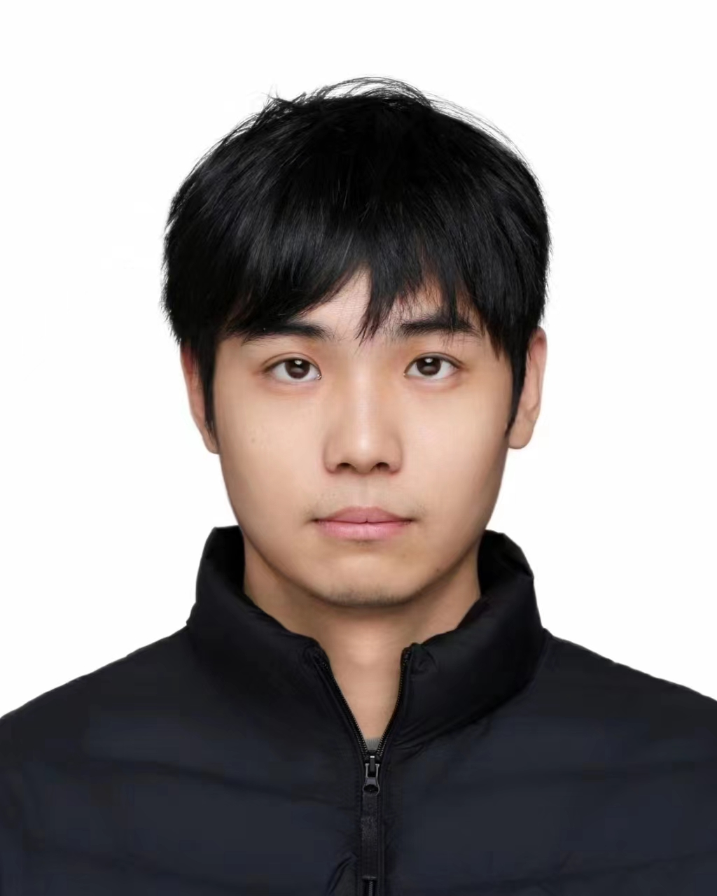
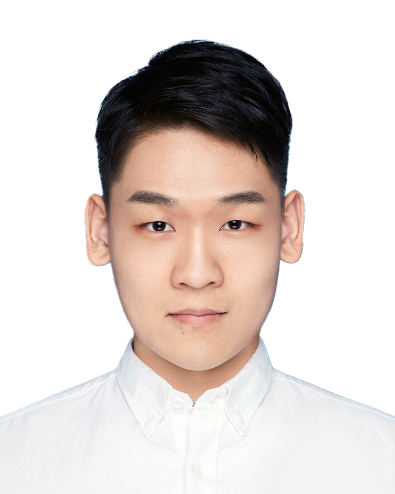

## Activities
  
**Barbecue** at HKUST campus on 16th Nov., 2024 

  
**Golf and group dinner** at The Jockey Club Kau Sai Chau Public Golf Course on 21st Sep., 2024 

  
**Chung Yeung Festival Hiking** to High Junk Peak on 21st Oct., 2023 

  
**Year end trip** to Lamma Island on 20th Dec., 2022 

## Postdocs

 [CHEN Liutao](https://chenlt326.github.io/), since Sep 23 
Highest degree so far: Ph.D., The Hong Kong University of Science and Technology

## Ph.D. & M.Phil.

 [DUAN Zeyu](https://zyduan-neptune.github.io/ZyDuan.github.io/), since Sep 22 
Highest degree so far: Master, Tongji University

 ZHENG Wanfu, since Sep 22 
Highest degree so far: Master, KTH Royal Institute of Technology

 WU Si, since Sep 22 
Highest degree so far: Master, Shanghai Jiao Tong University

 [LIN Zinan](https://zinanlin-oscar.github.io/), since Sep 23 
Highest degree so far: Master, HKUST

 [ZHANG Shihong](https://shihongzhang1999.github.io/), since Sep 23 
Highest degree so far: Master, Wuhan University

 [LI Mingchen](https://limingchen159.github.io/), since Sep 23 
Highest degree so far: Master, Tianjin University

 ZHAO Lige, since Sep 23 
Highest degree so far: Bachelor, Tsinghua University

 Parastoo MOHEBI, since Sep 23 
Highest degree so far: Master, Sharif University of Technology

 LI Siqi, since Feb 24 
Highest degree so far: Master, University of Tokyo

 LI Lunlong, since Sep 24 
Highest degree so far: Bachelor, Southeast University

 LI Shuhao, since Sep 24 
Highest degree so far: Bachelor, Southeast University

 LU Kunhan, since Sep 24 
Highest degree so far: Master, Tongji University

 HU Ziqi, since Sep 24 
Highest degree so far: Master, Nankai University

 CHENG Donald, since Sep 24 
Highest degree so far: Master, HKUST

 TANG Hadrian, since Sep 24 
Highest degree so far: Bachelor, HKUST

## Alumni

- [ZHOU Qi](https://kishuqizhou.github.io/), Postdoc, 2022-2024. Joining Midea

- [WANG Dan](https://danwang9264.github.io/), Postdoc, 2022-2024. Joining Beijing University of Civil Engineering and Architecture as Associate Professor

- LUO Haomin, MSc student, 2022. Joining University of Cambridge as a Ph.D student

- DING Yirong, MSc student, 2023. Joining Virginia Tech as a Ph.D student

- JIANG Zhan, MSc student, 2023. Joining Stevens Institute of Technology as a Ph.D student

- ZHAO Chenkai, MSc student, 2023. Joining Huawei

- ZHANG Daze, MSc student, 2023. Joining [P&T Group](https://web.p-t-group.com/en/)

- HAN Runze, MSc student, 2023. Joining 哈尔滨电气国际工程责任有限公司

- XU Lingming, MSc student, 2023. Joinging Alibaba Cloud

- FU Tianyu, MSc student, 2023. Joinging Shanghai Metro Group

- QU Yao, MSc student, 2023. Joinging HKUST as a Ph.D student

- SO Siu Kuen Ella, MSc student, 2023. Joinging Arup

- ZHOU Ya, MSc student, 2023. Joinging Meinhardt (Hong Kong) Limited

- WANG Ce, MSc student, 2023. Joinging Tianhua