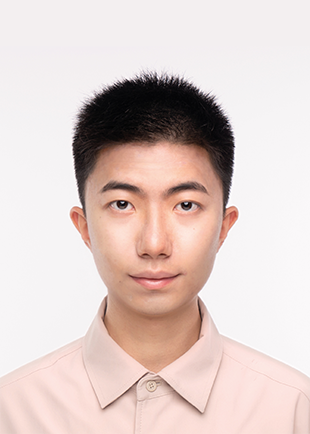
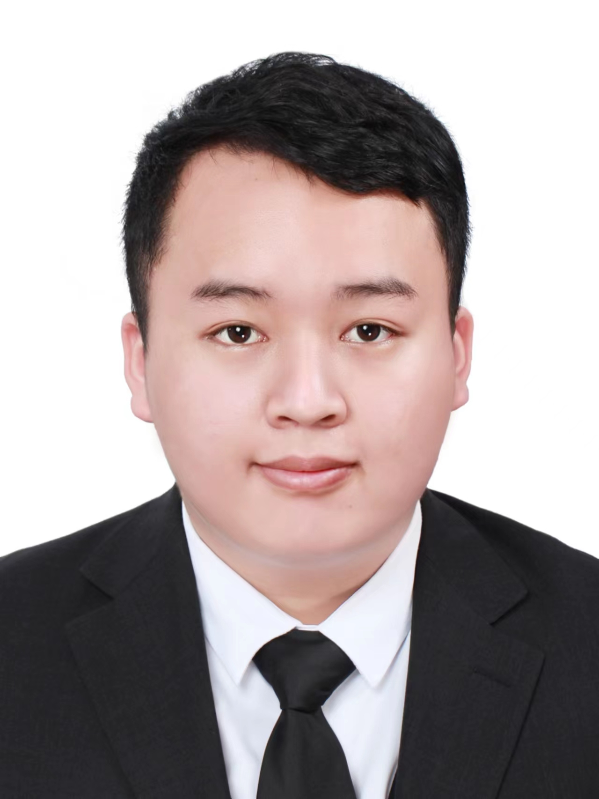

## Activities
  
**Yacht trip to the Victoria Harbour** on 24 May 2025 

  
**Barbecue** at HKUST campus on 16 Nov 2024 

  
**Golf and group dinner** at The Jockey Club Kau Sai Chau Public Golf Course on 21 Sep 2024 

  
**Chung Yeung Festival Hiking** to High Junk Peak on 21 Oct 2023 

  
**Year end trip** to Lamma Island on 20 Dec 2022 

## Postdocs

 [CHEN Liutao](https://chenlt326.github.io/), since Sep 23 
Highest degree so far: Ph.D., The Hong Kong University of Science and Technology

 WU Si, since Aug 25 
Highest degree so far: Ph.D., The Hong Kong University of Science and Technology

## Ph.D. & M.Phil.

 [ZHANG Shihong](https://shihongzhang1999.github.io/), since Sep 23 
Highest degree so far: Master, Wuhan University

 [LI Mingchen](https://limingchen159.github.io/), since Sep 23 
Highest degree so far: Master, Tianjin University

 ZHAO Lige, since Sep 23 
Highest degree so far: Bachelor, Tsinghua University

 Parastoo MOHEBI, since Sep 23 
Highest degree so far: Master, Sharif University of Technology

 LI Siqi, since Feb 24 
Highest degree so far: Master, University of Tokyo

 LI Lunlong, HKPFS Awardee, since Sep 24 
Highest degree so far: Bachelor, Southeast University

 LI Shuhao, since Sep 24 
Highest degree so far: Bachelor, Southeast University

 LU Kunhan, since Sep 24 
Highest degree so far: Master, Tongji University

 HU Ziqi, since Sep 24 
Highest degree so far: Master, Nankai University

 CHENG Donald, since Sep 24 
Highest degree so far: Master, HKUST

 TANG Hadrian, since Sep 24 
Highest degree so far: Bachelor, HKUST

 HU Yike, HKPFS Awardee, since Feb 25 
Highest degree so far: Master, Tianjin University

 LIU Jiatao, since Feb 25 
Highest degree so far: Master, Tianjin University

 JIANG Mengqi, since Feb 25 
Highest degree so far: Bachelor, Xi'an Jiaotong University

 LIU Yunqin, since Sep 25 
Highest degree so far: Master, Beihang University

 JIN Zhineng, since Sep 25 
Highest degree so far: Master, Sichuan University

 HUANG Qiqi, since Sep 25 
Highest degree so far: Master, Columbia University

 WANG Xinyu, HKPFS Awardee, since Sep 25 
Highest degree so far: Bachelor, Tsinghua University 

 LI Yanjie, since Sep 25 
Highest degree so far: Bachelor, Zhejiang University 

 NI Shuangshuang, since Sep 25 
Highest degree so far: Bachelor, Zhejiang University 

 LIN Jinxi, since Sep 25 
Highest degree so far: Bachelor, Sun Yat-sen University

 JIANG Huayu, since Sep 25 
Highest degree so far: Bachelor, East China University of Science and Technology

## Alumni

- [ZHOU Qi](https://kishuqizhou.github.io/), Postdoc, 2022-2024. Joining Midea

- [WANG Dan](https://danwang9264.github.io/), Postdoc, 2022-2024. Joining Beijing University of Civil Engineering and Architecture as Associate Professor

- [LIN Zinan](https://zinanlin-oscar.github.io/), MSc, 2022-2023, & MPhil, 2023-2024. Joining University of Southern Denmark with Marie Sklodowska-Curie PhD Scholarship

- [DUAN Zeyu](https://zyduan-neptune.github.io/ZyDuan.github.io/), PhD, 2022-2025. Joining Hong Kong Space Robotics and Energy Center as a Research Scientist

- ZHENG Wanfu, PhD, 2022-2025.

- LUO Haomin, MSc, 2022. Joining University of Cambridge as a Ph.D student

- DING Yirong, MSc, 2023. Joining Virginia Tech as a Ph.D student

- JIANG Zhan, MSc, 2023. Joining Stevens Institute of Technology as a Ph.D student

- ZHAO Chenkai, MSc, 2023. Joining Huawei

- ZHANG Daze, MSc, 2023. Joining [P&T Group](https://web.p-t-group.com/en/)

- HAN Runze, MSc, 2023. Joining 哈尔滨电气国际工程责任有限公司

- XU Lingming, MSc, 2023. Joinging Alibaba Cloud

- FU Tianyu, MSc, 2023. Joinging Shanghai Metro Group

- QU Yao, MSc, 2023. Joinging HKUST as a Ph.D student

- SO Siu Kuen Ella, MSc, 2023. Joinging Arup

- ZHOU Ya, MSc, 2023. Joinging Meinhardt (Hong Kong) Limited

- WANG Ce, MSc, 2023. Joinging Midea Group

- TONG Xinzhou, MSc, 2024. Joinging Zhejiang University as an executive counsellor